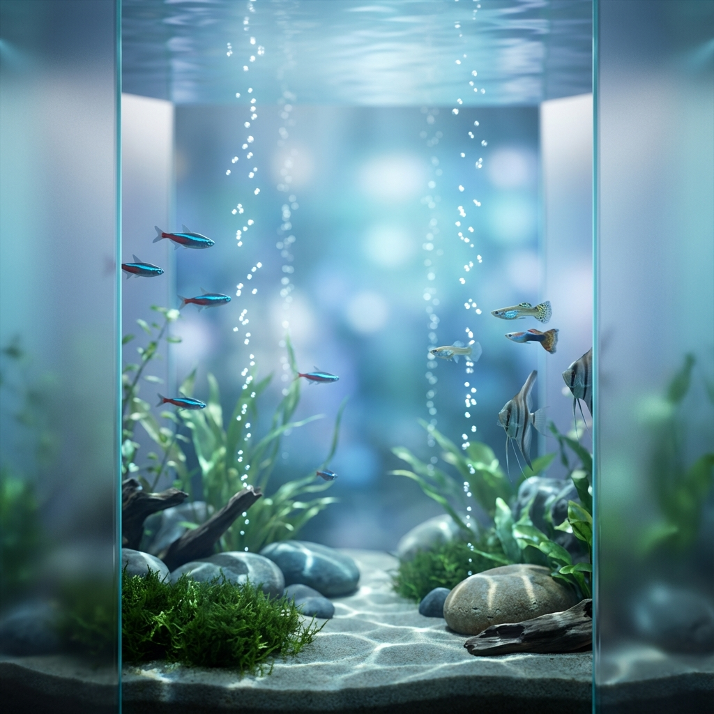

<div align="center">
  
</div>

# AquaRitual

水槽の育成体験で、日々の習慣化（ストリーク）を静かに継続できるアプリ。

## 想定プラットフォーム（仮）
- 対象: iOS / Web（必要ならPWA含む）
- 最優先: iOS
- 画面前提: モバイル優先 / レスポンシブ対応

> [!IMPORTANT]
> このリポジトリは **Convoy 管理下**で運用します。ワークフロー定義（`.agent/`）は本リポジトリには含めず、Convoy本体のワークフローを参照して進行します。

> [!NOTE]
> 実行フロー: `/branding-intake` → brief確定 → `/update-convoy-identity` → `/review-repo-quality` → 実装（例: `/build-app-simple`）


## Quick Start
```bash
# Install dependencies
pnpm install

# Start development server
pnpm dev
```

## Core Features
- **Habit Streaks**: 日々の習慣をストリークとして可視化
- **Aquarium Growth**: 習慣の継続により水槽が豊かに育つ
- **Calm & Focus**: 癒しと集中を提供する静かなUI
- **iOS First**: iOSアプリを最優先（Web/PWAは副次チャネルとして提供）
- **Responsive Web**: Webはモバイル優先でレスポンシブ対応

## Docs
- [Branding Brief](assets/branding/aqua-ritual/brief.md)
- [Architecture](docs/architecture.drawio)

## Convoy Workflows
- このリポジトリには `.agent/` を含めません（Convoy本体リポジトリ側を参照）。
- ワークフロー: Convoy本体の `.agent/workflows/` を参照（例: branding-intake / update-convoy-identity / review-repo-quality）

